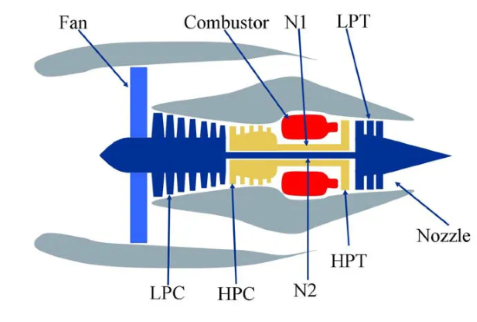
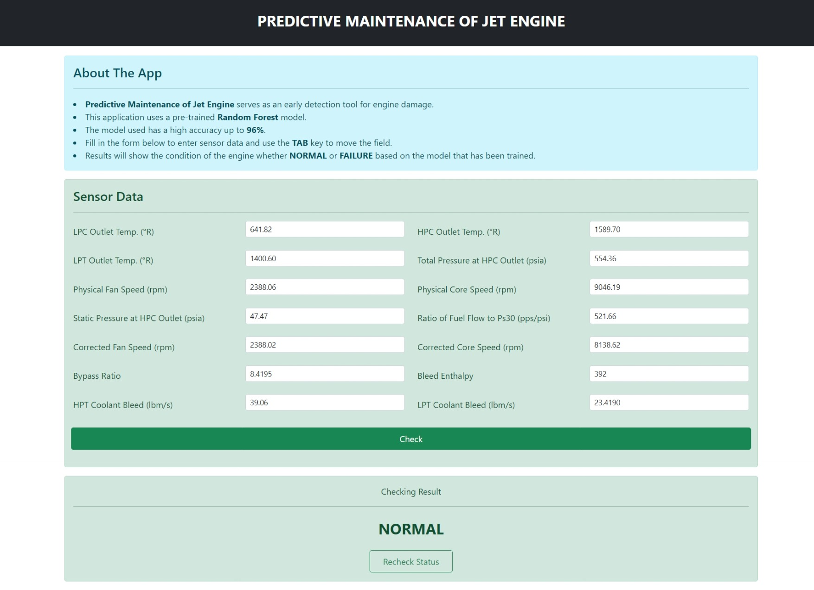
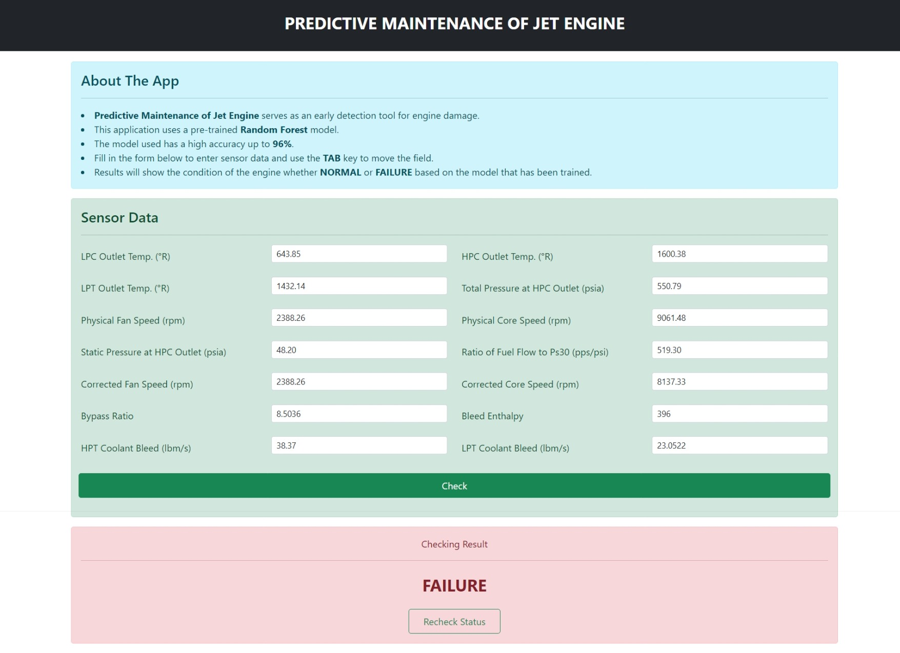

# Predictive Maintenance Engine Classification for NASA Turbofan Engines

<p align="center">
  
</p>

## Overview
Jet engines are one of the crucial components used in NASA's space industry. This engine is used as a source of power for a vehicle such as an airplane to be able to fly with the thrust generated from the engine. Seeing how crucial the role of the engine in a vehicle, an analysis is needed that is able to predict the health of the engine whether it is still functioning normally or has begun to require further maintenance. This aims to avoid sudden engine failure that could potentially endanger the vehicle. One way to measure engine performance is by using sensors. These sensors work to find out various things such as temperature, rotation, pressure, engine vibration, and others. Therefore, in this project, an analysis process will be carried out to predict engine health based on sensor data before the engine actually dies.

[CMAPSS Jet Engine Simulated Data]
(https://data.nasa.gov/Aerospace/CMAPSS-Jet-Engine-Simulated-Data/ff5v-kuh6/about_data)
provided by NASA is being used in this project to determine whether the machine is normal or failure.

## File Descriptions

1. `asset`. This folder contains images to help the reader understand the process.
2. `dataset`. This folder contains the datasets used in this project. There are 3 files namely train_FD001.txt, test_FD001.txt, and RUL_FD001.txt. However, only the train_FD001.txt file is used in this project.
3. `flask`. This folder contains a flask environment that is used to create a dashboard so that users are facilitated by only entering sensor data and then getting machine classification results without having to know the program code that works behind it.
4. `Survival_Analysis_Predictive_Maintenance.ipynb`. This file contains program code in the process of processing NASA datasets starting from business understanding, data understanding, data preparation, modeling, and evaluation (CRISP-DM methodology). From this file, the dataset is processed in such a way as to produce a model that is ready to be used for classification on the dashboard.

## Flask Setup
To operate flask app, follow the steps below:
1. From main directory, go to **flask** directory.  
   ```python
   cd flask
   ````
2. Create virtual environment (venv) on **flask** directory.  
   ```python
   python -m venv venv
   ```
3. Activate virtual environment.  
   Go to **venv** > **Scripts** directory. Then run command to activate venv.  
   ```python
   cd venv\Scripts 
   activate
   ```
4. Install dependencies.  
   Back to **flask** directory and run command to install all dependencies listed in requirements.txt file.  
   ```python
   cd ..\.. 
   pip install -r requirements.txt
   ```
5. Run flask from virtual environment.  
   Finally, run this command to run flask app in venv.  
   ```python
   flask run
   ```
6. Open browser app (e.g. Chrome) and then go to `localhost:5000` address.
7. Finish.

## Evaluation Result
|    Metrics Evaluation   | Random Forest | Artificial Neural Network |
| :---         |     :---:     |           :---:           |
| Accuracy     | 96.75%        | 96.77%                    |
| Precision    | 74.83%        | 75.22%                    |
| Recall       | 94.11%        | 93.55%                    |
| F1 Score     | 83.37%        | 83.39%                    |

The priority evaluation metric for this project is the recall value. The higher the recall value, the better the model is able to predict machine failure. From these results it can be concluded that the random forest model has a higher recall value. Therefore, in the flask app, a random forest model will be used to predict new data.

## Flask App Result
<p align="center">
  
</p>

This Flask app only requires 14 sensor data to be able to predict whether a machine is normal or has failed. These sensors are: `LPC Outlet Temp. (°R)`, `HPC Outlet Temp. (°R)`, `LPT Outlet Temp. (°R)`, `Total Pressure at HPC Outlet (psia)`, `Physical Fan Speed (rpm)`, `Physical Core Speed (rpm)`, `Static Pressure at HPC Outlet (psia)`, `Ratio of Fuel Flow to Ps30 (pps/psi)`, `Corrected Fan Speed (rpm)`, `Corrected Core Speed (rpm)`, `Bypass Ratio`, `Bleed Enthalpy`, `HPT Coolant Bleed (lbm/s)`, `LPT Coolant Bleed (lbm/s)`. The following is the flask app display for initial conditions, when the machine is predicted to be normal and failure.

|            Homepage            |              Engine Normal             |             Engine Failure              |
|              :---:             |                  :---:                 |                  :---:                  |
|   |   |   |
